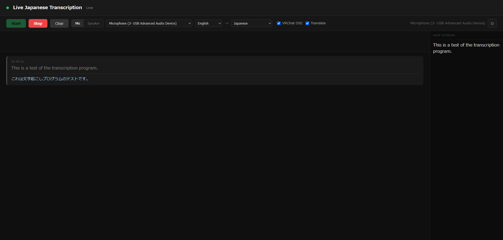

> [!WARNING]
> **Work in progress.** Expect rough edges, missing features, and breaking changes.

# Pizza Captions



Real-time speech transcription and translation running entirely on your machine. Captures audio from a microphone or system loopback (speaker output), transcribes with [faster-whisper](https://github.com/SYSTRAN/faster-whisper) via [WhisperLiveKit](https://github.com/QuentinFuxa/WhisperLiveKit), and optionally translates and forwards to VRChat via OSC.

## Features

- **Live transcription** - low-latency, streamed word by word
- **Mic or loopback** - capture your voice or anything playing through your speakers
- **Translation** - multiple backends with in-browser configuration
- **VRChat OSC** - send transcription/translation directly to the chatbox

## Requirements

- Windows (WASAPI loopback capture is Windows-only)
- Python 3.10.6+
- NVIDIA GPU with CUDA 12.1

## Setup

Run `setup.bat` - it will create a virtual environment, install PyTorch with CUDA 12.1 support, and install all dependencies from `requirements.txt`.

```
setup.bat
```

## Run

```
start.bat
```

Then open [http://localhost:3000](http://localhost:3000) in your browser.

## Translation Backends

| Backend | Key required | Notes |
|---|---|---|
| Google | No | Free, default |
| DeepL | Yes | High quality |
| OpenAI-compatible | Optional | Works with any OpenAI-format endpoint |
| OpenRouter | Yes | Routes to many models |
| LM Studio | No | Local, native API |
| LibreTranslate | No | Self-hosted |
| Ollama | No | Local |

## Configuration

Click **⚙** in the UI to configure the translation backend and API keys. Settings are saved to `config.json` and persist across restarts.