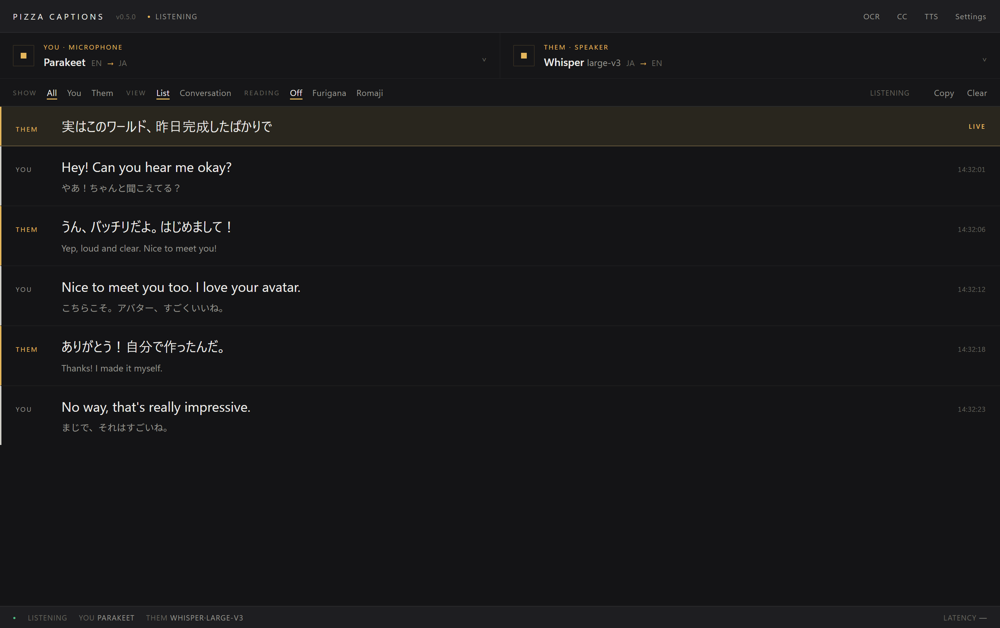

# Pizza Captions

Real-time speech transcription and translation that runs entirely on your machine. It listens to your microphone or your speaker output, transcribes with your choice of local engine, and can translate, speak, and forward the result to VRChat, all without sending your audio anywhere.

The interface is built around two **transports**, "You" (your microphone) and "Them" (your speaker audio). Each has its own engine, language, translation, and outputs, so you can set up both sides of a conversation at a glance.

## Features

### Transcription

- **Local speech to text**, streamed live. Nothing leaves your PC.
- **Swappable engines**: Whisper for accuracy on an NVIDIA GPU, Parakeet for speed on any CPU, plus experimental options. See the [engine table](#engines) below.
- **Mic or loopback**: capture your own voice or anything playing through your speakers.
- **Self-recovery**: if a Whisper session stalls (a silent crash, or a rare repeat loop), the app notices and restarts it on its own instead of going quiet.

### Two transports, and both at once

- Run "You" and "Them" **independently**, each with its own engine, language, and destinations.
- **Dual engine**: run both transports at the same time on supported engines. When both sides use the same engine, they share one loaded model, so the second side adds no extra memory or load time.
- Each transport's drawer sets its source device, engine, translation direction, and its outputs (VRChat OSC and TTS).

### Translation

- **Multiple backends** with in-app configuration: Google, DeepL, OpenAI-compatible, OpenRouter, LM Studio, LibreTranslate, and Ollama. See the [backend table](#translation-backends).
- **Prompt presets** for the local LLM translators (LM Studio, Ollama): pick a built-in preset or write your own in an inline editor.
- Failed translations show as "unavailable" rather than a blank line, and repeated failures pause translation instead of hammering a broken backend.

### On-screen captions overlay

- A floating **CC** bar sits over your game, on top and click-through, showing each line and its translation.
- Press **Alt+C** to unlock it (drag to move, click Japanese words to define), then **Alt+C** or click off it to lock again. Unlocking never steals focus, so the game keeps running underneath.

### Screen OCR

- Press **Alt+S** anytime, even inside a game, for a see-through overlay: drag a box over any on-screen text to read it.
- Copy or translate the result in place; for Japanese, click a word to look it up. Reads Chinese, English, Japanese, and 46 more Latin-script languages, on your GPU if you have one and the CPU otherwise. Optional and experimental.

### Japanese dictionary and reading aids

- **Click to define**: click a Japanese word in a caption or an OCR result for its dictionary form, reading, meaning, and the grammar behind a conjugation. Uses JMdict, runs locally.
- **High accuracy word splitting** (optional): a more capable segmenter that keeps compounds together, reads homographs in context, and recognizes modern slang even when conjugated.
- **Reading aids**: show **furigana** over kanji or **romaji** under Japanese lines, in the app and on the overlay.
- **Color words by type** (optional): nouns, verbs, adjectives, and adverbs each get a color so the words that carry the meaning stand out.

### Text to speech

- Optional: type a line, or have each caption voiced automatically, and the app speaks it into a virtual audio cable that VRChat uses as its mic. See the [voice table](#text-to-speech-1).

### VRChat and Windows

- **VRChat OSC**: send transcription or translation straight to the chatbox.
- **Windows 11 Live Captions as a source**: optionally feed the overlay and the transcript from Windows' own Live Captions instead of a downloaded engine.
- **Portable**: no Python install needed, everything runs from the extracted folder.

## Requirements

- Windows 10 or 11 (WASAPI loopback capture is Windows-only).
- An NVIDIA GPU is optional and recommended for the Whisper engines; Parakeet runs well on CPU.

## Getting started

1. Download the portable zip and extract the **whole folder** (do not run from inside the zip).
2. Double-click **`Start Pizza Captions.bat`**. A console window stays open showing what the app is doing. (In Settings > About you can create a "Pizza Captions" desktop shortcut that launches it.)
3. On first run, a short setup wizard walks you through picking a look, installing an engine, and choosing your microphone and language. It can also add the Japanese dictionary and Screen OCR.
4. Optional: pick a translation backend in Settings and turn on **Translate** for a transport.

Engines and models install under `%LOCALAPPDATA%\LiveTranscription` (manage them in Settings, under Engines); config and logs live in `%APPDATA%\LiveTranscription`.

## Engines

Engines install on demand as separate packs, so the base download stays small and you only fetch what you use. Each is named by hardware and role.

| Engine | Best for | Notes |
|---|---|---|
| **Whisper (GPU, accurate)** | Best accuracy, recommended default. Wants an NVIDIA GPU, falls back to CPU. | OpenAI Whisper decoded a whole sentence at a time with faster-whisper. Hallucinates less than the streaming variant. Models from ~145 MB (base) to ~4.5 GB (large-v3-turbo). |
| **Whisper (GPU, streaming)** | Word-by-word captions as you speak, on an NVIDIA GPU. | OpenAI Whisper streamed with WhisperLiveKit. Shares its models with Whisper (accurate). |
| **Parakeet (CPU, fast)** | Fast on any PC, no GPU needed. English, Japanese, and 24 European languages. | NVIDIA Parakeet on sherpa-onnx. ~640 MB per language. |
| **Parakeet (CPU, streaming)** (experimental) | The same models as Parakeet, but captions appear as you speak. | Streamed with local agreement for low latency. Shares Parakeet's models. |
| **Fun-ASR-Nano (CPU, LLM-based)** (experimental) | Accuracy on CPU, if you can wait a second or two after each phrase. Japanese, English, Chinese. | Alibaba Fun-ASR-Nano, a 0.6B recognizer. ~1.2 GB. |
| **Qwen3-ASR (GPU, LLM-based)** (experimental) | Another NVIDIA-GPU option alongside Whisper. Multilingual (52 languages). | Alibaba Qwen3-ASR, a 1.7B recognizer. ~2.4 GB. |

The setup wizard offers Whisper and Parakeet; the experimental engines live in Settings, under Engines, with a note explaining the catch. Download, switch, or delete individual models there too.

## Translation backends

| Backend | Key required | Notes |
|---|---|---|
| Google | No | Free, default |
| DeepL | Yes | High quality |
| OpenAI-compatible | Optional | Works with any OpenAI-format endpoint |
| OpenRouter | Yes | Routes to many models |
| LM Studio | No | Local, native API, supports prompt presets |
| LibreTranslate | No | Self-hosted |
| Ollama | No | Local, supports prompt presets |

## Text to speech

Optional. Install a voice pack in Settings, under Voices. You need a virtual audio cable (such as VB-Audio Cable) selected as VRChat's input device. Mic passthru can bridge your real microphone into that same cable, so you can still talk normally alongside it.

| Voice pack | Language | Notes |
|---|---|---|
| **Kokoro** | English | Neural, runs on CPU |
| **Kokoro Japanese** | Japanese | Neural, runs on CPU |
| **VOICEVOX** | Japanese | 200+ character voices, each with its own credit requirement |
| **Windows Voices** (experimental) | Whatever your OS has | Nothing to download |

## VRChat

Turn on **VRChat OSC** for a transport to send its captions to your chatbox. OSC must be enabled in VRChat's action menu (Options, then OSC, then Enabled).

## Updating

Download the new zip, extract it, and delete the old folder. Your settings, installed engines, and downloaded models live outside the app folder, so they carry over untouched. The app checks GitHub for new releases and puts a badge on the settings button when one is out.

## Configuration and files

Open **Settings** in the app to configure engines, models, translation, voices, the dictionary, OCR, and blocked phrases. Settings are saved to `%APPDATA%\LiveTranscription\config.json` and persist across updates. To reclaim disk space, uninstall engines and models in Settings, or delete `%LOCALAPPDATA%\LiveTranscription`.

## Troubleshooting

The console window shows what the app is doing; logs are also written to `%APPDATA%\LiveTranscription\logs`.

## Credits

Built on WhisperLiveKit, OpenAI Whisper models, faster-whisper, sherpa-onnx, NVIDIA Parakeet models (CC-BY-4.0, © NVIDIA Corporation), Fun-ASR-Nano, Qwen3-ASR, llama.cpp, Silero VAD, JMdict, PaddleOCR, and more. See [CREDITS.md](CREDITS.md) for the full list with licenses.

The optional text-to-speech feature can use **VOICEVOX** (Japanese) voices, powered by VOICEVOX. If you publish audio made with a VOICEVOX voice, you must credit the character as `VOICEVOX:キャラクター名` (for example `VOICEVOX:ずんだもん`); the app shows and copies the exact credit for the voice you are using. Individual characters may add their own terms.

## License

Source-available: free to use and modify for personal use, including in monetized streams and videos. No redistribution, but forking to open a pull request is welcome. See [LICENSE](LICENSE) and [CONTRIBUTING.md](CONTRIBUTING.md). Third-party components remain under their own licenses (see [CREDITS.md](CREDITS.md)).
