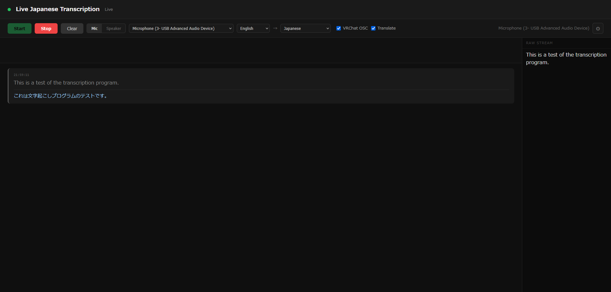

> [!WARNING]
> **Work in progress.** Expect rough edges, missing features, and breaking changes.

# Pizza Captions

Real-time speech transcription and translation running entirely on your machine. Captures audio from a microphone or system loopback (speaker output), transcribes with your choice of STT engine ([WhisperLiveKit](https://github.com/QuentinFuxa/WhisperLiveKit) or [sherpa-onnx](https://github.com/k2-fsa/sherpa-onnx) with NVIDIA Parakeet), and optionally translates and forwards to VRChat via OSC.

## Features

- **Live transcription** - low-latency, streamed word by word
- **Swappable engines** - Whisper for accuracy, Parakeet for speed on any PC
- **Mic or loopback** - capture your voice or anything playing through your speakers
- **Translation** - multiple backends with in-app configuration
- **Text to speech** - optional, speak in VRChat without using your voice
- **VRChat OSC** - send transcription/translation directly to the chatbox
- **Portable** - no Python install needed; everything runs from the extracted folder

## Requirements

- Windows 10/11 (WASAPI loopback capture is Windows-only)
- NVIDIA GPU optional, recommended for the Whisper engine; Parakeet runs well on CPU

## Getting started

1. Download the portable zip and extract the **whole folder** (don't run from inside the zip).
2. Double-click **`Start LiveTranscription.bat`**. A console window stays open showing what the app is doing.
3. First run: a setup wizard walks you through it, starting with which engine to install:

| Engine | Best for | Models |
|---|---|---|
| **Parakeet** (sherpa-onnx) | Fast on any PC, no GPU needed. English, Japanese + 24 European languages | ~640 MB per language |
| **Whisper** (WhisperLiveKit) | Best accuracy, wants an NVIDIA GPU. ~All languages | ~3 GB |
| **Parakeet Streaming** (experimental) | The same models as Parakeet, but captions appear as you speak instead of after each pause | Shares Parakeet's |
| **Fun-ASR-Nano** (experimental) | Accuracy on CPU, if you can wait a second or two after each phrase. English, Japanese, Chinese | ~1.2 GB |
| **Qwen3-ASR** (experimental) | Another option if you have an NVIDIA GPU, alongside Whisper. English, Japanese + 9 more | ~2.4 GB |

Setup offers Parakeet and Whisper; the experimental engines are in Settings → Engine.

4. Optional: pick a translation backend in Settings and enable **Translate**.

Engines and models install under `%LOCALAPPDATA%\LiveTranscription` (manage them in Settings → Engine); config and logs live in `%APPDATA%\LiveTranscription`.

## Updating

Download the new zip, extract it, and delete the old folder. Your settings, installed engines, and downloaded models live outside the app folder, so they carry over untouched. The app checks GitHub for new releases and puts a badge on **⚙** when one is out.

## VRChat

Enable the **VRChat OSC** checkbox to send captions to your chatbox. OSC must be enabled in VRChat's action menu (Options → OSC → Enabled).

## Text to speech

Optional. Type a line, or have each caption voiced automatically, and the app speaks it into a virtual audio cable that VRChat uses as its microphone. Install a voice pack in Settings → **Voices**:

| Voice pack | Language | Notes |
|---|---|---|
| **Kokoro** | English | Neural, runs on CPU |
| **Kokoro Japanese** | Japanese | Neural, runs on CPU |
| **VOICEVOX** | Japanese | 200+ character voices, each with its own credit requirement |
| **Windows Voices** (experimental) | Whatever your OS has | Nothing to download |

You need a virtual audio cable (such as VB-Audio Cable) selected as VRChat's input device. Mic passthru can bridge your real microphone into that same cable, so you can still talk normally alongside it.

## Translation Backends

| Backend | Key required | Notes |
|---|---|---|
| Google | No | Free, default |
| DeepL | Yes | High quality |
| OpenAI-compatible | Optional | Works with any OpenAI-format endpoint |
| OpenRouter | Yes | Routes to many models |
| LM Studio | No | Local, native API |
| LibreTranslate | No | Self-hosted |
| Ollama | No | Local |

## Configuration

Click **⚙** in the app to configure engines, models, translation backends, and blocked phrases. Settings are saved to `%APPDATA%\LiveTranscription\config.json` and persist across updates.

## Troubleshooting

The console window shows what the app is doing; logs are also written to `%APPDATA%\LiveTranscription\logs`. To reclaim disk space, uninstall engines/models in Settings or delete `%LOCALAPPDATA%\LiveTranscription`.

## Credits

Built on WhisperLiveKit, OpenAI Whisper models, sherpa-onnx, NVIDIA Parakeet models (CC-BY-4.0, © NVIDIA Corporation), Silero VAD, and more. See [CREDITS.md](CREDITS.md) for the full list with licenses.

The optional text-to-speech feature can use **VOICEVOX** (Japanese) voices, powered by VOICEVOX. If you publish audio made with a VOICEVOX voice, you must credit the character as `VOICEVOX:キャラクター名` (e.g. `VOICEVOX:ずんだもん`); the app shows and copies the exact credit for the voice you are using. Individual characters may add their own terms.

## License

Proprietary - all rights reserved. See [LICENSE](LICENSE). Third-party components remain under their own licenses (see [CREDITS.md](CREDITS.md)).
